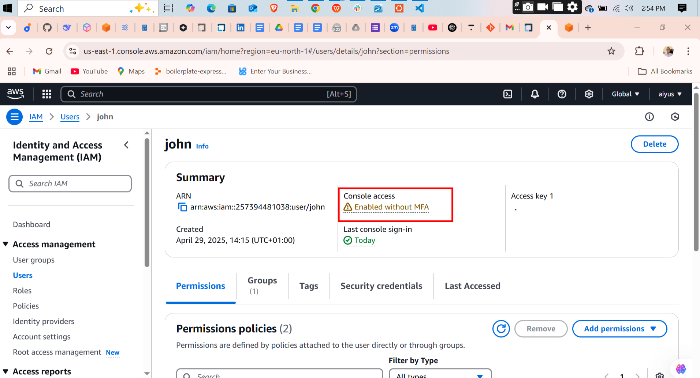
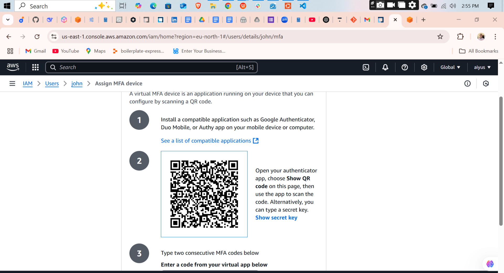
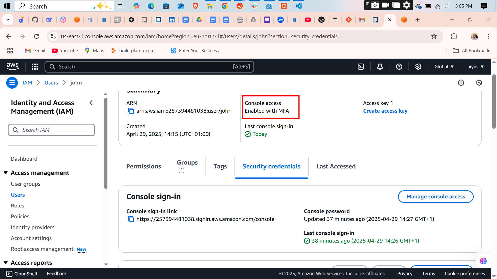
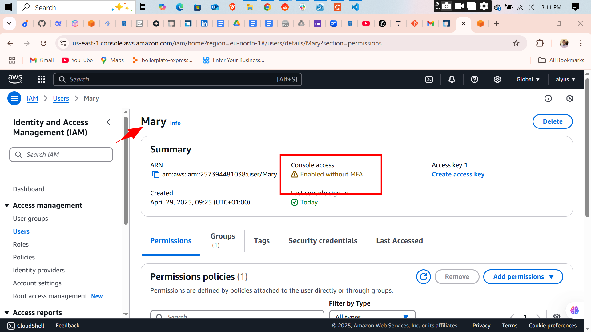
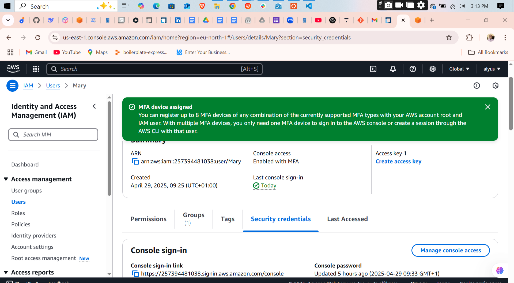

# 🛡️ AWS IAM Setup Project

This project documents how I configured AWS IAM (Identity and Access Management) to follow best practices for user, group, and permission management in a secure and structured way.

---

## 👥 Users and Groups

I created two IAM users:

- **John** – assigned to the `development-team` group.
- **Mary** – assigned to the `analysts-team` group.

Each user was grouped according to their functional role in the organization, enabling easier permission management through group-based policies.

---

## 🔐 Permissions and Policies

### 👨‍💻 John's Role – EC2 Access (Developer)

I created and attached a custom IAM policy for John that grants access to **Amazon EC2 services only**, including:

- Starting and stopping EC2 instances
- Describing EC2 resources
- Viewing EC2 instance metadata

John inherited this policy through the `development-team` group.

### 👩‍💼 Mary's Role – S3 Access (Analyst)

Mary was assigned a custom IAM policy that grants access to **Amazon S3 services only**, including:

- Listing buckets and objects
- Viewing S3 bucket policies
- Uploading and downloading files

This policy was attached to the `analysts-team` group, ensuring Mary only accesses what she needs.

---

## ✅ Multi-Factor Authentication (MFA)

To enhance account security, I enabled **Multi-Factor Authentication (MFA)** for both users:

- **John**: Virtual MFA enabled and paired with an authenticator app using the AWS CLI.
- **Mary**: MFA also enabled through a virtual device with enforced 2FA login.

MFA ensures that even if login credentials are compromised, access remains protected with an additional verification step.

---

## 🧰 Tools I Used

- **AWS Management Console** – for user creation and group setup
- **AWS CLI** – to configure MFA and test permissions
- **JSON** – for writing and attaching IAM policies

---

## 🚀 What I Learned

This hands-on IAM project helped me strengthen my understanding of:

- Role-based access control (RBAC) in AWS
- The principle of least privilege
- How to enforce account security using MFA
- IAM policy creation and group-based permission delegation

---

## 💭 Reflections

### 🔐 The Role of IAM in AWS

IAM (Identity and Access Management) is a foundational service in AWS that helps manage **who can do what** in your AWS environment. It allows you to securely control access to AWS services and resources by creating **users**, **groups**, and **roles**, and by applying **policies** that define their permissions.

By using IAM:
- I ensure **least-privilege access**, giving users only the permissions they need.
- I manage access **centrally** and **securely** without needing to share root credentials.
- I strengthen **security posture** with MFA and fine-grained permission policies.

IAM is essential in securing AWS accounts and enforcing accountability and separation of responsibilities.

### 👥 Difference Between IAM User and Group User

- An **IAM user** is a single identity used to represent a person or application that interacts with AWS.
- An **IAM group** is a collection of IAM users. Groups **simplify permission management** because you can attach policies to the group instead of each user individually.

In this project:
- John and Mary are both **IAM users**.
- John belongs to the `development-team` group, while Mary belongs to the `analysts-team` group.
- Instead of assigning permissions directly to each user, I attached policies to their respective groups, promoting **scalability and cleaner access control**.

### 🛠️ The Process of Creating an IAM Policy

Creating an IAM policy involves writing a **JSON document** that defines what actions are allowed or denied for which resources.

Here's the process I followed:

1. **Identify the actions** the user or group needs (e.g., `ec2:DescribeInstances`, `s3:ListBucket`).
2. **Determine the resources** they should apply to (e.g., specific S3 buckets or all EC2 instances).
3. **Write a policy document** in JSON format using the standard structure:
   ```json
   {
     "Version": "2012-10-17",
     "Statement": [
       {
         "Effect": "Allow",
         "Action": "s3:ListBucket",
         "Resource": "arn:aws:s3:::example-bucket"
       }
     ]
   }
   ```
4. **Attach the policy** to a user, group, or role using the AWS Console or CLI.
5. **Test the permissions** to confirm the access is functioning as expected.

This hands-on process gave me practical knowledge of how AWS enforces access control using policies, and how powerful (and precise) these configurations can be.

---

## 🔒 Significance of the Principle of Least Privilege

The **Principle of Least Privilege (PoLP)** is a security best practice that ensures users are granted **only the permissions they need**—nothing more, nothing less.

By applying least privilege:
- I **reduce the attack surface** of the AWS environment.
- I **minimize risk** from accidental changes or malicious activity.
- I **enforce accountability**, since every action is more traceable and deliberate.

In cloud environments like AWS, where services are powerful and interconnected, the least privilege is a **critical control** for preventing unnecessary or unauthorized access to sensitive resources.

---

## 🧠 Reflections on the John & Mary Scenario

In this hands-on IAM project, I set up two users—**John** and **Mary**—each with different responsibilities and access requirements.

- **John** belongs to the `development-team`, and his role involves managing **EC2 instances**. I ensured his IAM policy **only** included EC2-related permissions. He couldn't access S3, RDS, or any unrelated services. This limits potential mistakes or abuse outside his job scope.

- **Mary**, part of the `analysts-team`, only needs access to **S3 buckets** to analyze stored data. Her policy was strictly scoped to S3 actions. She had **no access to EC2**, since it's irrelevant to her work.

This experience helped me understand how IAM enables **granular access control**. By giving users permissions only to the services they need, I created a **secure and organized AWS environment**. It also showed how IAM groups can scale this model across larger teams—policies apply at the group level, simplifying management without compromising security.

This practical application of **role-based access** and the **least privilege principle** gave me real-world insight into how cloud security is enforced in a scalable and manageable way.

---

## 🖼️ Project Screenshots

### 👤 Creating IAM Users
(Insert screenshots here)

### 🔍 Testing IAM Permissions
(Insert screenshots here)

### 🔐 Enabling MFA
(Insert screenshots here)

---

## 📁 Suggested Folder Structure

```
## 🖼️ Project Screenshots

### 👤 Creating IAM Users


---

### 🔍 Testing IAM Permissions


---

### 🔐 Enabling MFA







